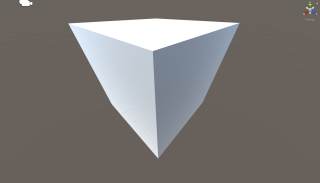

[日本語はこちら / Japanese](README.ja.md)

# Unity Scene FoV Control

Unity Editor Extension which enables controlling Scene View's FoV.

|Wide FoV			|Narrow FoV				|
|--------------------		|-------------------------		|
|	|	|

Sometimes, [people](https://feedback.unity3d.com/suggestions/editor-camera-fov-adjustable) [complains](https://feedback.unity3d.com/suggestions/scene-view-camera-field-of-view-adjustment) for lack of Unity Editor's FoV control.
This Unity Editor extension is answer for them (at least part of it).

## How to use

- Import [this .unitypackage](https://github.com/t-mat/UnitySceneViewFovControl/releases/download/0.1.2/SceneViewFovControl.unitypackage) to your Unity project.
    - Use "Assets > Import Package > Custom Package..." when you want to import it from file.
- After importing, you'll use the folloing control in the Scene View.

|Keyboard/Mouse			|Effect				|Note			|
|--------------------		|-------------------------	|----			|
|Ctrl + Alt + Wheel		|Change FoV			|			|
|Ctrl + Alt + Shift + Wheel	|Change FoV (Faster)		|Doesn't work with MacOS|
|Ctrl + Alt + O			|Increase FoV			|			|
|Ctrl + Alt + P			|Decrease FoV			|			|
|Ctrl + Alt + Shift + O		|Increase FoV			|			|
|Ctrl + Alt + Shift + P		|Decrease FoV (Faster)		|			|

Also when you change FoV of Scene View, you'll see "reset" button at top left corner of Scene View.
FoV will reset when you push the button.  Also it'll disappear in 2 seconds.

## Change settings and store

You can show settings window via "Edit > Scene View FoV Settings"

|Item				|Meaning				|
|--------------------		|-------------------------		|
|FoV Speed			|FoV changing speed			|
|FoV <Shift> Modifier Multiplier|Multiplier when you pressing Shift	|
|Min FoV			|Minimum FoV value			|
|Max FoV			|Maximum FoV value			|
|				|					|
|Disable			|Disable this editor extension		|
|Save				|Save settings				|
|Default			|Restore default settings		|
|Close				|Close settings window			|

## License

[MIT](LICENSE.txt)
